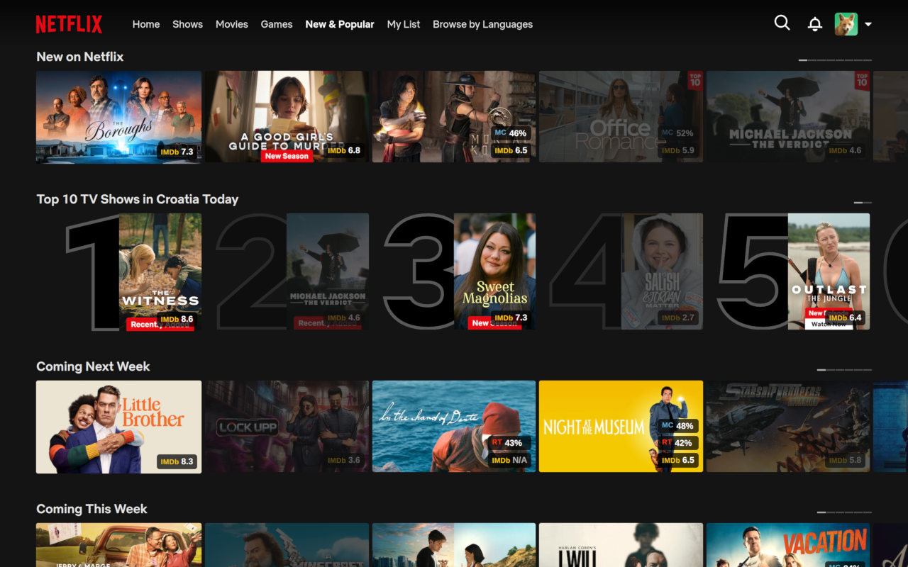
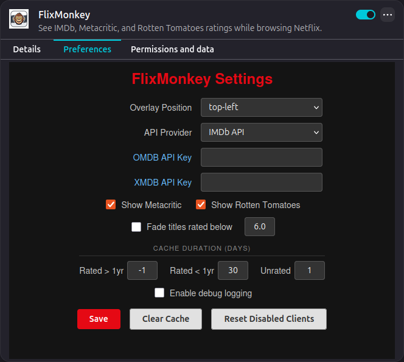

# FlixMonkey

[](https://github.com/fran2889/flix-monkey/releases)
[](https://chromewebstore.google.com/detail/flixmonkey/ipbiebdbicmlajmbcghkcdkobmcaoadl)
[](https://addons.mozilla.org/en-US/firefox/addon/flixmonkey/)
[](LICENSE)
[](https://github.com/fran2889/flix-monkey/actions/workflows/ci.yml)
[](https://github.com/fran2889/flix-monkey/actions/workflows/nightly.yml)

See IMDb, Metacritic, and Rotten Tomatoes ratings while browsing Netflix and HBO Max.

---

## Table of Contents

- [How It Looks](#how-it-looks)
- [Installation](#installation)
- [Features](#features)
- [Settings](#settings)
- [Troubleshooting](#troubleshooting)
- [Development](#development)
- [Privacy Policy](#privacy-policy)
- [License](#license)

---

## How It Looks




---

## Installation

Use the links below to install the add-on for your browser.

[](https://chromewebstore.google.com/detail/flixmonkey/ipbiebdbicmlajmbcghkcdkobmcaoadl)
[](https://addons.mozilla.org/en-US/firefox/addon/flixmonkey/)
[](https://github.com/fran2889/flix-monkey/releases/latest/download/FlixMonkey.user.js)

> The userscript version requires [Tampermonkey](https://www.tampermonkey.net/) (Chrome, Edge, Firefox, Opera, Safari), [Violentmonkey](https://violentmonkey.github.io/) (Chrome, Edge, Firefox), or [Greasemonkey](https://www.greasespot.net/) (Firefox).

---

## Features

- **Rating Badges**: View IMDb ratings on titles, title previews, and detail pages; Metacritic and Rotten Tomatoes scores are available when using OMDb or XMDb providers
- **Click to Open**: Click rating badges to open the title's IMDb page or search IMDb when no match is found
- **Color-Coded Ratings**: Rating badges change color based on thresholds (red < 5.0, green >= 8.5)
- **Customizable**: Change badge position, choose rating provider, fade titles below a rating threshold, and more
- **Smart Caching**: Fast lookups for titles you've seen before; configurable expiration per title type (old, recent, without rating)
- **Multi-Tab Sync**: Requests and settings are synchronized across Netflix and HBO Max tabs to prevent redundant lookups
- **Auto-Disable**: Failing APIs are temporarily disabled for 1 hour to prevent lag

---

## Settings

> FlixMonkey supports multiple rating providers. The default (FM-DB + Agregarr) requires no API key but provides IMDb ratings only. OMDb and XMDb require free API keys, but they are more reliable and also provide Rotten Tomatoes and Metacritic scores.

Access settings via:

- **Chrome**: Click the FlixMonkey icon in your browser toolbar
- **Firefox**: Click the FlixMonkey icon in your browser toolbar, or go to `about:addons`, select FlixMonkey and go to the **Preferences** tab
- **Userscript**: Open your userscript manager (Tampermonkey/Violentmonkey/Greasemonkey) and click on the **FlixMonkey Settings** menu item



### Display Options

| Option                     | Default             | Description                                                                       |
| -------------------------- | ------------------- | --------------------------------------------------------------------------------- |
| Enabled Streaming Services | Netflix and HBO Max | Run FlixMonkey on Netflix and HBO Max, both enabled by default                    |
| Rating Badge Position      | Top Left            | Corner where rating badges appear                                                 |
| Rotten Tomatoes            | No                  | Display RT score. Only available when OMDb is the rating provider                 |
| Metacritic                 | No                  | Display Metacritic score. Only available when OMDb or XMDb is the rating provider |

### Rating Providers

| Option          | Default          | Description                                                                                  |
| --------------- | ---------------- | -------------------------------------------------------------------------------------------- |
| Rating Provider | FM-DB + Agregarr | Active rating provider. Default uses FM-DB for IMDb ID lookup and Agregarr for IMDb ratings. |
| OMDb API Key    | _empty_          | [Get a free API key](https://www.omdbapi.com/apikey.aspx). Required when OMDb is selected    |
| XMDb API Key    | _empty_          | [Get a free API key](https://xmdbapi.com/api-key). Required when XMDb is selected            |

### Fade Settings

| Option            | Default | Description                                         |
| ----------------- | ------- | --------------------------------------------------- |
| Fade Below Rating | No      | Fade titles rated below the threshold               |
| Fade threshold    | 6.0     | IMDb rating below which to fade (0.0-10.0)          |
| Allow Override    | No      | Show button to override fade state in title preview |

### Cache Settings

| Option                    | Default      | Description                                                                 |
| ------------------------- | ------------ | --------------------------------------------------------------------------- |
| Older Titles (Cache TTL)  | -1 (forever) | Cache duration (days) for rated titles > 1 year old. Set -1 to never expire |
| Recent Titles (Cache TTL) | 30           | Cache duration (days) for rated titles <= 1 year old                        |
| No Rating (Cache TTL)     | 1            | Cache duration (days) for unrated or not-found titles                       |

### Advanced

| Option               | Default | Description                                                |
| -------------------- | ------- | ---------------------------------------------------------- |
| Enable debug logging | Yes     | Enable verbose console logging to help troubleshoot issues |

### Settings Actions

- **Save**: Apply configuration changes and refresh the Netflix tab
- **Clear Cache**: Remove all cached ratings, forcing fresh lookups for all titles
- **Reset Disabled Providers**: Re-enable any rating providers that were automatically disabled due to failures

---

## Troubleshooting

**Rating badges are not showing**

Loading placeholder badges should show immediately, before the ratings are retrieved. If not, that means the extension is not active or failed to load.

1. Verify the extension is enabled in your browser toolbar.
2. For the userscript version, confirm your userscript manager is active and FlixMonkey script is loaded.
3. Refresh the Netflix page.
4. Open browser developer tools (F12) and check the Console tab for errors.

**Badges are showing but there are no ratings**

This usually means that the rating provider is failing or disabled. If the problem persists, select a different provider.

1. Open browser developer tools (F12) and check the Console tab for errors.
2. Check the Console to see if your rating provider was disabled. Providers are auto-disabled for 1 hour after failures.
3. Re-enable disabled providers in Settings to retry.
4. Switch to a different rating provider. Default provider (FM-DB + Agregarr) can be unreliable.

**Rating shown does not match the rating on IMDb page**

Titles are identified by name only, because Netflix does not provide year or additional metadata. There can be a mismatch when multiple titles share the same name.

1. Tooltip on the rating badge shows title and year as returned by the rating provider. Verify it matches the Netflix title.
2. If the tooltip confirms title match, the provider rating may be outdated since it isn't directly from IMDb. Recent releases have shorter cache times to ensure ratings are updated.
3. If the tooltip shows a different title, try selecting a different rating provider and clear the cache. This can help because providers have different result ordering logic.

**Metacritic and Rotten Tomatoes scores are not showing**

Most often MC/RT score is not shown on a title because it was not returned by the rating provider. A provider supporting MC/RT does not mean that it will return a score for every title.

1. If MC/RT scores are missing on all titles, check your settings.
2. Check if your current rating provider supports these scores; OMDb supports both, XMDb supports Metacritic only.
3. Make sure that Metacritic and Rotten Tomatoes are enabled in Settings under Show Ratings.

**Ratings are loading slowly**

Rating providers are rate-limited so FlixMonkey spreads requests over time. Ratings are cached, so subsequent lookups will be instant.

1. Wait 10-15 seconds to see if ratings populate.
2. Open browser developer tools (F12) and check the Console tab for errors if ratings still do not appear.

**Still need help?**

Netflix may change their layout, breaking title discovery or rating badge positioning. A new FlixMonkey version may have introduced a bug.

Please report these issues with as much detail as possible.

1. Verify your API keys are correctly configured for your selected rating provider.
2. Open browser developer tools (F12) and check the Console and Network tabs for errors or relevant logs.
3. Open a [GitHub issue](https://github.com/fran2889/flix-monkey/issues) with details about the problem and steps to reproduce it.

---

## Development

FlixMonkey uses JavaScript (ES2022, ES modules) with Rollup for bundling, ESLint for linting, Prettier for formatting, and Vitest for testing.

This project requires Node.js >= 24.

```bash
npm install
npm run build    # Build all targets
npm run dev      # Watch mode with auto-rebuild
npm test         # Run unit and UI tests
```

To test locally:

1. Run `npm run build:chrome` or `npm run build:firefox`
2. In Chrome: go to `chrome://extensions`, enable **Developer mode**, click **Load unpacked**, and select `dist/chrome`
3. In Firefox: go to `about:debugging`, click **This Firefox**, then **Load Temporary Add-on**, and select any file in `dist/firefox`

See [CONTRIBUTING.md](CONTRIBUTING.md) for full development details.

---

## Privacy Policy

FlixMonkey does not collect, store, or transmit any personal data about you.

**What it does:**

- **Title lookups**: When you browse Netflix, the title names visible on the page are sent to third-party rating APIs (FM-DB, Agregarr, OMDb, and XMDb) solely to retrieve ratings. No account information, viewing history, or Netflix credentials are included in these requests.
- **Local storage only**: All cached ratings, settings, and API keys are stored exclusively in your browser's local extension storage (or userscript storage). This data never leaves your device except as part of the API requests described above.
- **No telemetry**: FlixMonkey does not include any analytics, crash reporting, or usage tracking of any kind.
- **No developer servers**: All network requests go directly from your browser to the third-party rating APIs. There is no intermediary server operated by this project.

**Third-party APIs:**

By default, title lookups use [FM-DB](https://imdb.iamidiotareyoutoo.com/) for IMDb ID lookup and [Agregarr](https://agregarr.org/docs/imdb-ratings/) for ratings. When you opt-in to OMDb or XMDb (which requires your own API key), requests are made to [OMDb](https://www.omdbapi.com/) and/or [XMDb](https://xmdbapi.com/). Your use of these services is subject to their respective privacy policies.

---

## License

[GPL-3.0-or-later](LICENSE)
